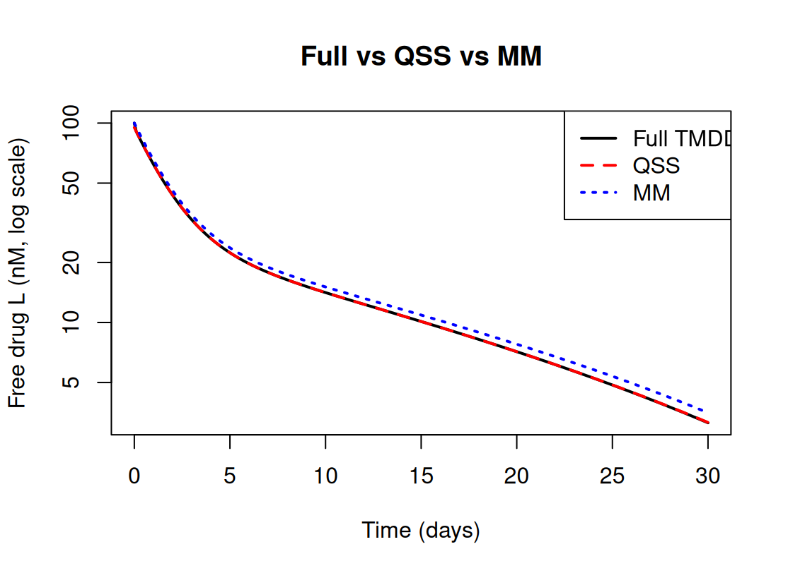
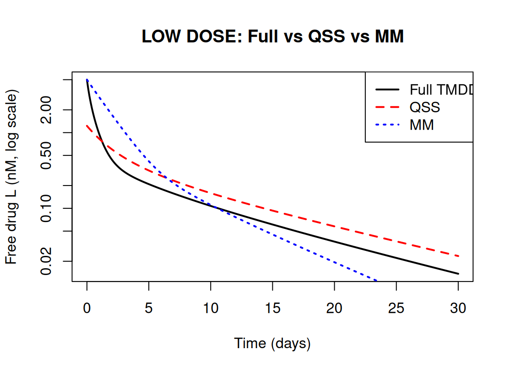
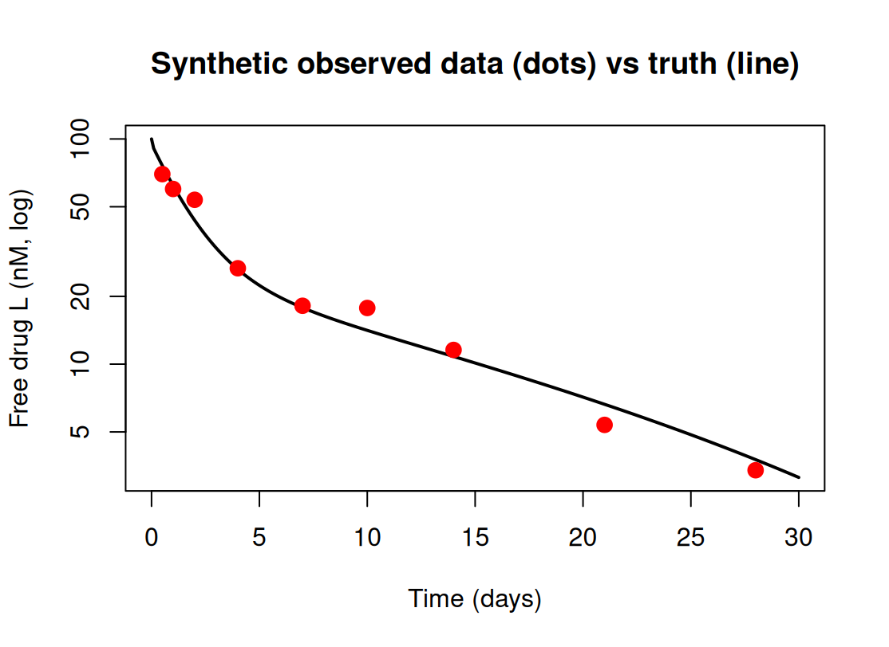
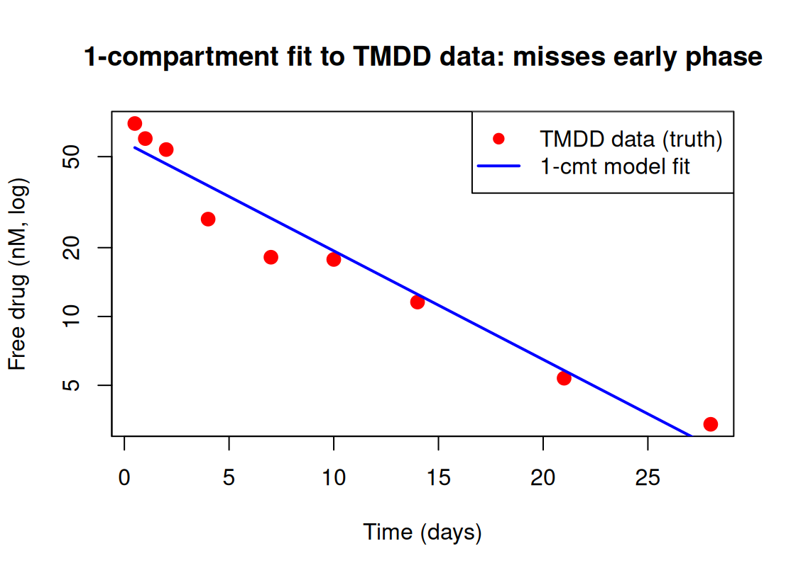

# Target-Mediated Drug Disposition (TMDD): Full Model, Approximations, and a Fitting Study

A from-scratch implementation of a target-mediated drug disposition (TMDD) model in R, together with its two standard reduced forms — the quasi-steady-state (QSS) and Michaelis–Menten (MM) approximations. The project has two parts: a **simulation study** showing where the approximations hold and where they break, and a **fitting study** showing what happens when you fit a model that is too simple to TMDD-shaped data.

Author: Jyotheeshwar Akshay Ravikumar
Institution: Sri Ramachandra University (SRIHER), Chennai, India
Field: Quantitative Systems Pharmacology / Pharmacometrics
Tools: R, rxode2 (simulation), nlmixr2 (estimation)

---

## Why TMDD

Many biologics — monoclonal antibodies in particular — are eliminated in part by binding to the very target they act on. At low drug concentrations the target is a meaningful sink: it grabs drug, saturates, and is internalised. At high concentrations the target is overwhelmed and ordinary linear elimination dominates. The result is the characteristic TMDD concentration–time curve: a steep, nonlinear early phase that straightens into a slower linear terminal phase.

Because the full TMDD system is stiff (drug–target binding is much faster than elimination or target turnover), the field uses reduced approximations. The whole point of this project is to understand, by building them myself, **when those approximations are trustworthy and when they are not.**

---

## The models

**Full TMDD (four ODEs, Mager–Jusko structure).** Free drug `L`, drug in tissue `Lt`, free target `R`, and drug–target complex `RC`:

```
dL/dt  = -(kel + kon*R)*L + koff*RC - kpt*L + ktp*Lt
dLt/dt =  kpt*L - ktp*Lt
dR/dt  =  ksyn - kdeg*R - kon*L*R + koff*RC
dRC/dt =  kon*L*R - (koff + kint)*RC
```

with the target at its pre-dose steady state `R0 = ksyn/kdeg`.

**QSS approximation.** Assumes drug–target binding equilibrates effectively instantly, so the complex is given by an algebraic balance rather than its own differential equation. Tracks total drug and total target; free drug is recovered each step by solving a quadratic. Still represents target turnover.

**Michaelis–Menten approximation.** The cruder reduction: the target is dropped entirely and its effect is replaced by a single saturable elimination term `Vmax*L/(Km + L)` on top of linear clearance.

Parameters used (representative monoclonal-antibody scale, units nM and 1/day):

| Parameter | Value | Meaning |
|---|---|---|
| kel | 0.15 | linear elimination of free drug |
| kpt / ktp | 0.30 / 0.20 | central ↔ tissue distribution |
| kon | 0.50 | drug–target association (the fast process) |
| koff | 0.10 | complex dissociation |
| kint | 0.10 | complex internalisation |
| ksyn / kdeg | 0.55 / 0.11 | target synthesis / degradation (R0 = 5 nM) |

The MM constants were derived from the binding parameters as `Vmax = kint*R0` and `Km = (koff + kint)/kon`. These are first-principles estimates, not calibrated values — see the note under the low-dose result.

---

## Part 1 — Simulation: where the approximations hold and break

### High dose (drug ≫ target): all three agree

At a high dose (free drug initialised at 100 nM against a 5 nM target), the target saturates quickly and contributes little to elimination. In this regime the full model and QSS are visually indistinguishable, and MM tracks them closely — with only a slight, late deviation where MM rides marginally above the others in the terminal phase.



This is the easy regime. The near-agreement here is expected and, on its own, is not an interesting result — it just confirms the approximations are coded correctly and that all three converge when the target is saturated. The slight MM deviation already hints at the larger failure seen at low dose.

### Low dose (drug ~ target): MM breaks, QSS holds

The interesting regime is low dose, where the drug never saturates the target and TMDD nonlinearity dominates throughout. Here the three models separate clearly, and they fail in *opposite directions at opposite times*:

- **MM** starts too high and decays too slowly through the early phase (it sits above the full model until roughly day 6), then crosses over and decays too fast in the terminal phase, running well below the truth by the end.
- **QSS** errs the other way: it starts slightly too low early, tracks the bend reasonably, then runs slightly high in the tail.

So neither approximation is exact at low dose, but QSS stays much closer to the full model throughout, while MM gets both the early shape and the terminal slope wrong.



**This contrast is the central finding of the simulation study:** the validity of a TMDD approximation depends on the dosing/saturation regime. MM is adequate when the target is saturated (high dose) but fails when it is not (low dose); QSS is the more robust reduction across regimes. This mirrors the conclusions of the canonical approximation literature (Gibiansky et al., 2008), reproduced here from my own implementation.

> **Honest caveat.** The *qualitative* result — MM breaks down at low dose while QSS remains close — is robust. The *exact* way the MM curve diverges (where it over- or under-shoots, and by how much) depends on the `Vmax`/`Km` values, which here were derived analytically rather than calibrated. The figures should be read for the pattern, not the precise decimals.

---

## Part 2 — Fitting: what happens when the model is too simple

To turn this from a pure simulation exercise into an estimation one, I generated synthetic "observed" data from the full TMDD model (high-dose profile) by sampling at realistic blood-draw times and adding 15% proportional measurement noise.



I then fitted a **simple one-compartment model** to this TMDD-generated data using nlmixr2. Because the dataset is a single concentration profile, between-subject variability is not estimable, so the model was fitted with fixed effects only (FOCEi); the structure was written as an explicit ODE (`d/dt(centr) = -ke*centr`, `cp = centr/V`).

Fitted estimates: CL ≈ 0.19, V ≈ 1.73, ke ≈ 0.11.



The fit converges, but it is **systematically biased**: the one-compartment model underpredicts the early concentrations, overpredicts through the middle, and only converges with the data in the terminal phase. A one-compartment model has a single elimination slope (a straight line on a log scale) and therefore physically cannot represent the two-phase TMDD curve — a fast target-binding phase followed by a slow linear phase. It compromises by splitting the difference, producing a directional, non-random residual pattern.

**This is the finding of the fitting study:** the misspecification is not noise, it is structural. Target-mediated kinetics cannot be captured by a model that has no representation of the target. The systematic residual pattern is exactly the diagnostic signature a pharmacometrician would use to reject the one-compartment model and reach for a TMDD or quasi-equilibrium structure.

---

## What this project demonstrates

- Implementing a full four-state TMDD ODE system from the governing equations, in rxode2.
- Deriving and coding the QSS and MM approximations, including the quadratic free-drug recovery in QSS.
- Designing a simulation experiment (high vs low dose) that isolates *when* an approximation is valid, rather than only showing that it can be.
- Generating synthetic data with a realistic error model and fitting it in nlmixr2.
- Diagnosing structural model misspecification from a systematic residual pattern, and explaining it mechanistically.
- Honest reporting of what is robust (qualitative regime-dependence) versus what is sensitive to uncalibrated constants.

---

## Repository structure

```
tmdd-approximations/
  README.md
  tmdd_step1_simulate.R           full model, QSS, MM, simulations, synthetic data, fit
  tmdd_highdose_comparison.png    Part 1 — all three models agree at high dose
  tmdd_lowdose_comparison.png     Part 1 — MM breaks, QSS holds at low dose
  tmdd_synthetic_data.png         Part 2 — synthetic observed data vs truth
  tmdd_fit_misspecification.png   Part 2 — 1-cmt fit shows systematic bias
  LICENSE
```

---

## How to reproduce

```r
# Install (once)
install.packages(c("rxode2", "nlmixr2"))

# Open tmdd_step1_simulate.R and run top to bottom.
# No external data required — synthetic data is generated in-script.
# Developed on Posit Cloud (R 4.6.0, Linux).
```

---

## References

1. Mager DE, Jusko WJ (2001). General pharmacokinetic model for drugs exhibiting target-mediated drug disposition. *J Pharmacokinet Pharmacodyn* 28(6):507–532.
2. Gibiansky L, Gibiansky E, Kakkar T, Ma P (2008). Approximations of the target-mediated drug disposition model and identifiability of model parameters. *J Pharmacokinet Pharmacodyn* 35(5):573–591.
3. Fidler M, Wilkins JJ, Hooijmaijers R, et al. (2019). Nonlinear Mixed-Effects Model Development and Simulation Using nlmixr and Related R Open-Source Packages. *CPT Pharmacometrics Syst Pharmacol* 8(9):621–633.

---

Part of a pharmacometrics portfolio in preparation for doctoral research in Quantitative Systems Pharmacology. Project 1: [Theophylline population PK model](https://github.com/jyotheeshwarakshay-ux/Theophylline-popPK).
